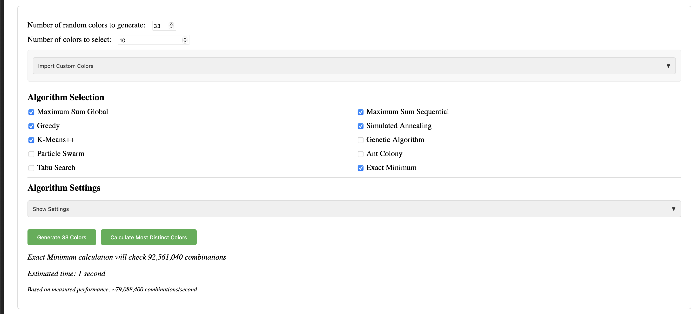
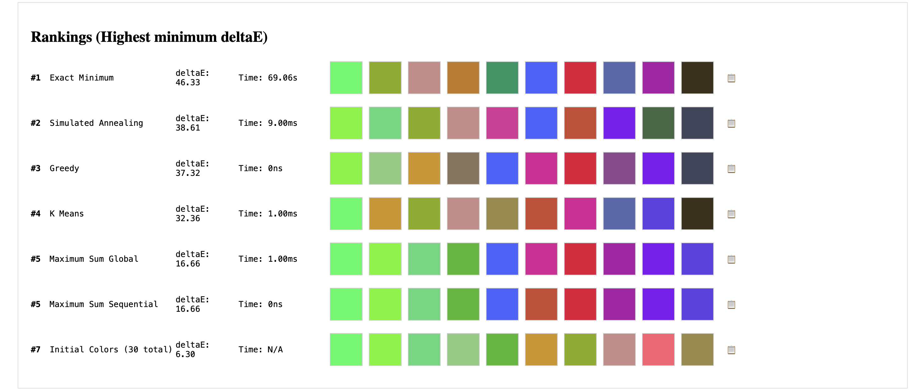

# Pick Distinct Colors

A library for analyzing and selecting maximally distinct colors. This package provides tools for working with colors in Lab color space, calculating color distances, and implementing various algorithms to select sets of colors that are maximally distinct from each other.

Available in both **JavaScript** (npm package) and **Python** implementations.

## Demo


Check out the [live demo](https://bdamokos.github.io/color-distance/) to see the algorithms in action and compare their results to find the best one for your needs or to directly get the colors you need.




## Features

- Convert colors between RGB and Lab color spaces
- Calculate deltaE (color difference) between colors
- Analyze color distributions in Lab space
- Multiple algorithms for selecting distinct colors:
  - Maximum Sum (Global & Sequential): Maximizes the sum of distances between all pairs
  - Exact Minimum: Finds colors with the maximum minimum distance
  - Greedy Selection: Fast algorithm that selects colors one by one
  - K-Means++: Clusters colors and selects representatives
  - Random Selection: Randomly selects colors (baseline algorithm)
  - Simulated Annealing: Probabilistic method good for escaping local optima
  - Genetic Algorithm: Population-based method for exploring multiple solutions
  - Particle Swarm: Swarm intelligence for continuous optimization
  - Ant Colony: Swarm intelligence for discrete optimization
  - Tabu Search: Local search with memory to avoid revisiting solutions

## Project Structure

```
color-distance/
├── js/
│   ├── algorithms/           # Algorithm implementations
│   │   ├── maxSumDistances.js
│   │   ├── exactMinimum.js
│   │   ├── exactMaximum.js
│   │   ├── greedy.js
│   │   ├── kmeans.js
│   │   ├── random.js
│   │   ├── genetic.js
│   │   ├── particleSwarm.js
│   │   ├── antColony.js
│   │   ├── tabu.js
│   │   └── simulatedAnnealing.js
│   └── utils/               # Utility functions
│       ├── colorUtils.js    # Color space conversion & metrics
│       ├── timeUtils.js     # Performance timing
│       ├── plotUtils.js     # Visualization
│       ├── algorithmUtils.js # Algorithm helpers
│       ├── performanceUtils.js # Performance calibration
│       ├── uiUtils.js       # UI functionality
│       ├── calculationUtils.js # Calculation helpers
│       └── importExportUtils.js # Import/export functions
├── css/
│   └── styles.css          # Application styles
└── index.html             # Main application page

## Language Implementations

### JavaScript (npm package)
The main implementation is available as an npm package with a web demo. See the sections below for JavaScript usage.

### Python Implementation
A complete Python port is available in the `python/` directory. See the [Python README](python/README.md) for installation and usage instructions.


## JavaScript Usage

### Basic Color Utilities

```javascript
import { rgb2lab, deltaE } from './js/utils/colorUtils.js';

// Convert RGB to Lab
const rgb = [255, 128, 0];
const lab = rgb2lab(rgb);
console.log(lab); // [65.48, 39.04, 67.14]

// Calculate color difference
const color1 = rgb2lab([255, 0, 0]);
const color2 = rgb2lab([0, 255, 0]);
const difference = deltaE(color1, color2);
console.log(difference); // 128.3
```

### Selecting Distinct Colors

```javascript
import { maxSumDistancesGlobal } from './js/algorithms/maxSumDistances.js';
import { exactMinimumDistance } from './js/algorithms/exactMinimum.js';
import { greedySelection } from './js/algorithms/greedy.js';

// Generate some random colors
const initialColors = Array.from({ length: 100 }, () => [
  Math.floor(Math.random() * 256),
  Math.floor(Math.random() * 256),
  Math.floor(Math.random() * 256)
]);

// Using different algorithms
const result1 = maxSumDistancesGlobal(initialColors, 5);
const result2 = exactMinimumDistance(initialColors, 5);
const result3 = greedySelection(initialColors, 5);
```

## Algorithm Comparison

| Algorithm | Time Complexity | Best For | Trade-offs |
|-----------|----------------|----------|------------|
| Maximum Sum Global | O(n choose k) | Optimal sum of distances | Very slow for large sets |
| Maximum Sum Sequential | O(n * k) | Balance of speed/quality | May miss global optimum |
| Exact Minimum | O(n choose k) | Maximum minimum distance | Very slow for large sets |
| Exact Maximum | O(n choose k) | Maximum distance | Very slow for large sets |
| Greedy | O(n * k) | Quick results | Local optimum only |
| K-Means++ | O(n * k * i) | Even distribution | Cluster-based, not distance-based |
| Random | O(k) | Baseline comparison | No optimization |
| Simulated Annealing | Variable | Escaping local optima | Results vary by parameters |
| Genetic Algorithm | O(p * g * k) | Complex spaces | Parameter-dependent |
| Particle Swarm | O(p * i * k) | Continuous spaces | Parameter tuning needed |
| Ant Colony | O(a * i * k) | Discrete spaces | Good for large sets |
| Tabu Search | O(i * k) | Avoiding local optima | Memory intensive |

Where:
- n: number of input colors
- k: number of colors to select
- i: iterations
- p: population size
- g: generations
- a: number of ants

## Development

### Setup

```bash
# Clone the repository
git clone https://github.com/bdamokos/color-distance.git
cd color-distance

# Install dependencies
npm install

# Start development server
npm run dev
```

### Build Tools

This project uses several build tools to ensure code quality and compatibility:

- **Rollup**: Module bundler that combines our JavaScript files into a single file, with tree-shaking to remove unused code
- **Babel**: Transpiles modern JavaScript to be compatible with older browsers
- **ESLint**: Checks code for potential errors and enforces consistent style
- **Prettier**: Formats code consistently

### Available Scripts

```bash
# Build for production
npm run build

# Run tests
npm test

# Lint code
npm run lint

# Format code
npm run format
```

## Contributing

Contributions are welcome! Please feel free to submit a Pull Request. For major changes, please open an issue first to discuss what you would like to change.

## License

This project is licensed under the MIT License - see the [LICENSE](LICENSE) file for details.

# Alternatives
Check out the excellent [iwanthue](https://medialab.github.io/iwanthue/) project for a similar purpose.